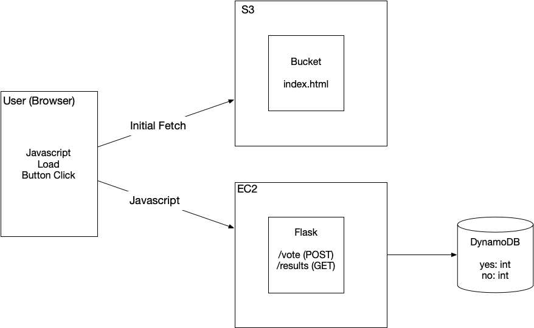

## Overview

This version of the voting system hosts the `index.html` file in an S3 bucket and the API for voting with Flask/Redis on an EC2 instance.




## Launch the API


For the `voting_monolith`, we created a security group named `httpssh`.  This security group should still be present.  You can check using the AWS CLI:

```
aws ec2 describe-security-groups
```

Most settings are the same as before.  However, we need to set the IAM instance profile (`LabInstanceProfile`) to allow the instance to access the DynamoDB table:

```
aws ec2 run-instances --image-id ami-06b21ccaeff8cd686 --instance-type t2.micro --key-name vockey --security-groups httpssh --user-data file://userdata.sh --tag-specifications 'ResourceType=instance,Tags=[{Key=Name,Value=voting_dynamodb_s3_ec2_cli}] --iam-instance-profile Name=LabInstanceProfile'
```

Changes to this server (from the `s3_ec2` version:

* Access a DynamoDB table instead of Redis
* Do not install Redis on EC2


## Update the Static Webpage

The javascript in `index.html` uses the variable `server` to know where to get voting API.  This variable is declared on line 8 as `const server = 'http://FIXME-API-HOST-IP';`.  Replace the FIXME portion with the IP address of your EC2 instance.


After you add the IP address, upload the `index.html` file to the S3 bucket:

```
aws s3 cp index.html s3://<voting-website-bucket>
```


## DynamoDB Table Creation

We will store the data in a table named `VoteCounts` with the following structure

```
[
  {
    VoteType: yes,
    Count: 12
  },
  {
    VoteType: no,
    Count: 23
  }
]
```
  


Create a table in DynamoDB:

* **Table name** - `VoteCounts`
* **Partition key** - `VoteType` (String)


All other settings are the default values.
